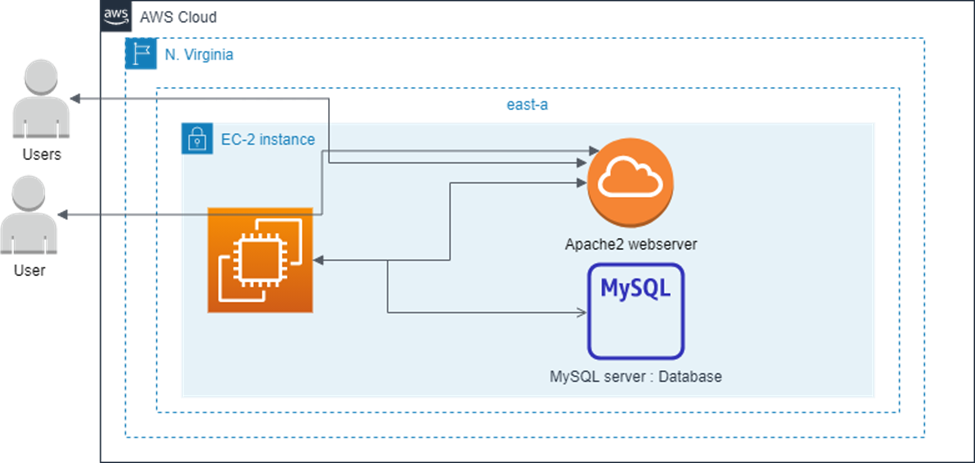

# Description" This is a wordpress deployment on AWS using AWSec-2 instance. You can install Wordpress in a click by using AWS \*\*Lightsail, but this is a traditional way of installing wordpress on aws ec2. This will create a virtual computer on EC2, install and configure a web server, database management system and finally install wordpress and connect to the web site through the public ip of the ec-2 instance.

**Before following these steps. Make sure your ec-2 instance is ready and you can ssh into that instance.**

1. ## Connect to your ec-2 instance.

---

### To update apt and install web server - apache2 on the ec2 server.

- sudo apt update
- sudo apt install apache2

### We now check if the webserver is installed successfully.

- copy the public IP and paste in browser and hit enter.
- If the below page appears, then the web server is installed successfully.

2. ## We now install php run time on the ec2 server to run WordPress, this is because the WordPress run on php.

---

- sudo apt install php libapache2-mod-php php-mysql
- We also need to install mySQL to host the wordpress database.
- sudo apt install mysql-server
- we now need to do a little configuration on mysql server.
- We need to change mysql authentication on plugins to mysql enable password, so that you can login to mysql with your password. This is what will be required to install wordpress.
  - Now let’s login to mysql server to configure this with the root user and create another user in addition to the root.
  - We create a database for wordpress.
  - We grant all privileges to the user we created on the database. This will enable the user to operate and manage the database.
    - sudo mysql -u root
    - ALTER USER ‘root’@localhost IDENTIFIED WITH mysql_native_password BY ‘Ishpassword@123’;
    - CREATE USER ‘wp_user’@localhost IDENTIFIED BY ‘Ishpassword@123’;
    - CREATE DATABASE wp;
    - GRANT ALL PRIVILEGES ON wp.\* TO ‘wp_user’@localhost;
    - Exit to exit mysql

3. ## Now let’s go ahead and install wordpress.
   ***
   - Change to temp directory and download the wordpress package from wrodpress site. - cd /tmp - wget https://wordpress.org/latest.zip - Unzip the file to get the wordpress folder. - unzip latest.zip
   - Confirm if the folder is moved successfully by moving to that directory.
   - We now move the wordpress folder to the document root of apache - sudo mv wordpress/ /var/www/html/ - cd /var/www/html/ ls
   - Let’s test the wordpress through the browser to get to the installation page of the wordpress by entering the ip address and hit enter.
     - http://34.228.25.213/wordpress/

### From here click on the Let’s go button and go ahead and configure the wordpress.

4. ## Configure the wordpress settings.

   ***

   - Remember the database name, the user and the password we created for the database during the database configuration. Refer this in the above steps.

     - Database Name: wp
     - Username: wp_user
     - Password: Ishpassword@123
     - Leave the Database Host and Table Prefix as default and click enter.

   - Upon clicking the enter button and error will display like the below. But no need to worry about it because I got you covered.

   - Copy the below code and go back to the terminal like below.

   - Change to the wordpress directory and create a file called wp-config.php.
     - cd /wordpress
     - touch wp-config
   - Edit the file with nano and paster the codes in it.
     - nano wp-config
     - Save it and exit the file.
     - Now move back to the browser.
   - Click on run installation button and the below page will display.

   - Configure site name, you can choose the name that best fit your site.
     - Site Title: Ish site
   - Configure the username and password for the admin page.
     - Username: Ish_user
     - Password: Ishpassword@123
   - Configure the email address for your website.
     - Email: ish\*\*\*\*@gmail.com
   - Click on install WordPress to start the installation.

   - Below will display when all configuration is correct and this means your wordpress is successfully installed.

   - Click on the login and this will display the admin login page.

   - Enter the username and password you configured and click on enter.
     - Username: ish_user
     - Password: Ishpassword@123
   - The below will display. This is the administrator page where you can create your pages and contents.

   - To confirm your wordpress is running, click on the Go to or
   - Open a browser and enter your ip address slash wordpress this will display the default webpage from wordpress like below.
     - http://34.228.25.213/wordpress
     - This will tell you; you have successfully installed wordpress on your ec2 instance.
     - You can modify the page based on your own customization.

5. ## Now everything is set and done. But the problem is I don’t want to enter the long address to get to my site. This means I don’t want my wordpress site to be served on the subdirector like this;” http://34.228.25.213/wordpress”, I want it to be served on the root directory or the domain. I only want to enter the ip address or the domain and this should get me to the website. Let’s get down to do this configuration. Currently when you enter the ip address you will see the web server configured or served on apache root directory.

   ***

   - In other to change this. Let’s get this done by changing configuration of the apache settings on the webserver.
     - Move to the terminal and change directory to apache.
   - cd /etc/apache2/sites-available/
     - list the files and edit a life called 000-default.conf
     - ls
     - sudo nano 000-default.conf
   - Change the line on the documentRoot.

   - To /var/www/html/wordpress.

   - Save and Exit.
   - Restart the apache server.
     - sudo systemctl restart apache2
   - Test the site if this configuration is done successfully.
     - http://34.228.25.213/

### Should in case you have your own domain, and you want to configure on this site.

- Edit the same file and add the servername and server alias to it, save and exit.
- ServerName ishwebsite.com
- ServerAlias www.ishwebsite.com
- Save the file and exit.
- Restart the apache server.
- sudo systemctl restart apache2
- This will take about an hour for your domain to reflect.
- This is the end of the journey. Thank you.

### This is the architecture of the project. All the applications such as apache webserver, mySQL server and wordpress are hosted on the ec-2 instance.

